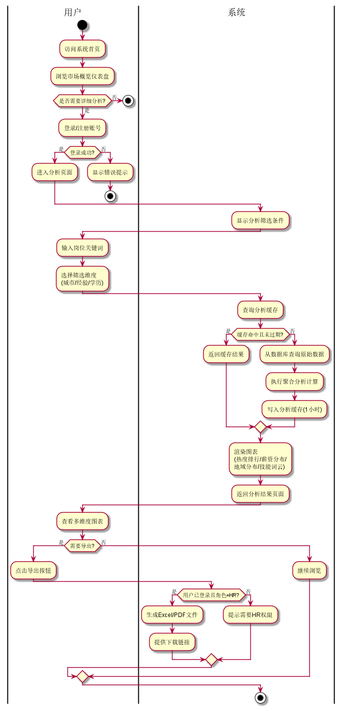

<div align="center">

# 职言 ZhiYan · 招聘信息实时数据分析系统

**Real-Time Recruitment Data Analysis System**

实时采集多平台招聘数据，经过清洗、挖掘与多维统计分析，输出招聘市场行情的可视化分析大屏。

[](#)
[](#)
[](#)
[](#)
[](#)
[](#)
[](#)
[](#)
[](#license)

</div>

---

## 📖 项目简介

「职言」是一套**从数据采集到可视化展示的全链路招聘数据分析平台**，实现对 BOSS 直聘、前程无忧（51job）等主流招聘平台岗位数据的实时抓取、清洗、存储、多维度统计分析与大屏可视化展示，并配套用户权限管控、容器化部署与监控告警能力。

> 本项目为重庆大学大数据与软件学院《软件综合实践》课程项目（2026）。

## ✨ 核心特性

| 能力 | 说明 |
|---|---|
| 🔍 **多源实时采集** | BOSS 直聘 + 前程无忧（51job）双平台，支持 Scrapy / Selenium / Playwright 多策略采集，防反爬、Cookie 轮换、失败重试 |
| 🧹 **数据清洗去重** | 精确去重 + 模糊去重（difflib），字段标准化、敏感数据脱敏（手机号掩码） |
| 🗄️ **分层数据存储** | 原始库 + 业务库 + 缓存（MySQL + Redis），ORM 模型 + DDL 建表脚本 |
| 📊 **多维统计分析** | 热门岗位、城市分布、薪资分布（按城市/经验）、词云、技能分析等 10+ 分析维度 |
| 🖥️ **可视化大屏** | ECharts 地图 / 饼图 / 柱状图 / 词云，支持筛选联动、全屏大屏、深色主题 |
| 🔐 **用户权限** | 注册 / 登录 / JWT 鉴权，管理员与普通用户角色 |
| 🚀 **容器化部署** | Docker Compose 一键编排 11 个服务，Nginx 反向代理 |
| 📈 **监控告警** | Prometheus + Grafana + Loki + Promtail + Alertmanager，7 条告警规则 |
| 🧪 **质量保障** | 405 个测试用例 + 25 个 API 端点测试全通过 |

## 🧱 系统架构

```
招聘平台（BOSS直聘 / 51job）
        │  采集（Scrapy / Selenium / Playwright）
        ▼
┌─────────────────────────────────────────────┐
│  爬虫模块 crawler/  →  Processor 清洗管道     │
│  （去重、标准化、脱敏、质量评估）              │
└──────────────────────┬──────────────────────┘
                       ▼
              MySQL（业务库）+ Redis（缓存）
                       │
                       ▼
        Flask / FastAPI 分析 API
                       │
                       ▼
           Vue 3 + ECharts 可视化大屏
```

架构设计详见 [docs/design/system_architecture.md](docs/design/system_architecture.md)，主流程图：

<div align="center">
  
</div>

## 🚀 快速开始

### 方式一：Windows 一键启动（推荐本地体验）

```bat
setup.bat
```

脚本会自动安装前端依赖、启动后端（`http://localhost:5000`）与前端（`http://localhost:5173`）。

| 测试账号 | 密码 | 角色 |
|---|---|---|
| `test@rdas.com` | `Test1234` | 管理员 |

### 方式二：Docker Compose 一键部署

```bash
docker compose up -d
```

| 服务 | 地址 |
|---|---|
| 前端 / Nginx | http://localhost |
| 后端 API | http://localhost:5000 |
| Prometheus | http://localhost:9090 |
| Grafana | http://localhost:3001 |

### 方式三：手动分别启动

```bash
# 后端（Flask）
cd backend
pip install -r requirements.txt
python run_dev.py          # http://localhost:5000

# 前端（Vue 3）
cd frontend
npm install
npm run dev                # http://localhost:5173
```

## 📁 项目结构

```
recruitment-analytics/
├── backend/                # Flask 主后端
│   ├── run.py / run_dev.py / run_crawler.py
│   └── app/
│       ├── api/            # RESTful 接口
│       ├── crawler/        # 爬虫模块（base/boss/job51/unified/anti_crawl）
│       ├── processor/      # 清洗管道与去重
│       ├── analysis/       # 统计分析 + Redis 缓存
│       ├── models/         # ORM 数据模型
│       ├── tasks/          # Celery 定时任务
│       └── utils/          # 工具
├── backend_fastapi/        # FastAPI 后端（异步版本）
├── frontend/               # Vue 3 + Element Plus 前端
│   └── src/
│       ├── views/          # 页面（Dashboard/CityAnalysis/SalaryAnalysis/...）
│       ├── components/     # 图表与交互组件
│       ├── stores/         # Pinia 状态
│       └── styles/         # 主题（含深色主题）
├── docs/                   # 需求 / 设计 / 测试 / 运维文档
├── data/                   # 采集数据与样例 CSV
├── monitoring/             # Prometheus / Grafana / Loki 配置
├── nginx/                  # Nginx 反向代理配置
├── docker-compose.yml      # 11 服务容器编排
├── setup.bat               # Windows 一键启动
├── CLAUDE.md               # 项目章程 / AI 协作规范
└── LICENSE
```

## 🔌 API 概览

| 方法 | 端点 | 说明 |
|---|---|---|
| GET | `/api/v1/jobs` | 岗位列表（支持 platform/city/关键词筛选） |
| GET | `/api/v1/jobs/cities` | 城市列表（含坐标与图标） |
| GET | `/api/v1/jobs/stats/overview` | 统计总览（平均薪资等） |
| GET | `/api/v1/analysis/hot-jobs` | 热门岗位排行 |
| GET | `/api/v1/analysis/city-distribution` | 城市分布 |
| GET | `/api/v1/analysis/salary-distribution` | 薪资分布（按城市/经验分组） |
| POST | `/api/v1/auth/register` | 用户注册 |
| POST | `/api/v1/auth/login` | 用户登录（JWT） |

完整接口规范见 [docs/design/api_documentation.md](docs/design/api_documentation.md)。

## 🛠️ 技术栈

| 层次 | 技术 |
|---|---|
| 后端语言 | Python 3.x |
| Web 框架 | Flask / FastAPI |
| 爬虫 | Scrapy + Selenium + Playwright |
| 数据库 | MySQL + Redis |
| 数据分析 | Pandas + NumPy + Jieba |
| 可视化 | ECharts |
| 前端 | Vue 3 + Element Plus + Pinia |
| 异步任务 | Celery |
| 部署 | Docker + Nginx |
| 监控 | Prometheus + Grafana + Loki + Alertmanager |

## 🗺️ 里程碑交付物

### M1 — 数据采集与处理 ✅

| # | 交付物 | 说明 |
|---|--------|------|
| 1 | 多平台采集脚本 | `crawler/boss.py` + `crawler/job51.py` + `crawler/unified.py` |
| 2 | 多渠道覆盖 | BOSS 直聘 + 前程无忧（51job），可扩展 |
| 3 | 数据去重 | 精确去重 + 模糊去重（difflib） |
| 4 | 容错机制 | 请求重试、反爬检测、逐字段异常捕获 |
| 5 | 采集监控 | `crawl_logs` 表 + Grafana 面板 |
| 6 | 清洗管道 | PipelineOrchestrator 统一调度 |
| 7 | 数据质量评估 | 必填字段检查、薪资范围验证 |
| 8 | 敏感数据脱敏 | 手机号掩码（138\*\*\*\*5678） |

### M2 — 数据存储与 API ✅

| # | 交付物 | 说明 |
|---|--------|------|
| 1 | 数据库设计 | ER 图、表结构、索引策略 |
| 2 | DDL 建表脚本 | 5 张表完整 DDL |
| 3 | ORM 数据模型 | job / user / analysis / crawl_log |
| 4 | 数据入库脚本 | `scripts/seed_data.py` |
| 5 | RESTful API | 岗位、分析、认证三大类端点 |
| 6 | API 文档 | 完整接口规范 |

## 📚 文档导航

| 类别 | 文档 |
|---|---|
| 需求 | [docs/requirements/requirements_spec.md](docs/requirements/requirements_spec.md) |
| 架构 | [docs/design/system_architecture.md](docs/design/system_architecture.md) |
| 数据库 | [docs/design/database_design.md](docs/design/database_design.md) |
| API | [docs/design/api_documentation.md](docs/design/api_documentation.md) |
| 部署 | [docs/operations/deploy-guide.md](docs/operations/deploy-guide.md) |
| 测试 | [docs/test/test_report.md](docs/test/test_report.md) |
| 用户手册 | [docs/user_manual.md](docs/user_manual.md) |

## 👨‍💻 作者

- **杨昱晨**（人工智能 1 班，20243909）—— 重庆大学大数据与软件学院

## 📄 License

本项目采用 [MIT License](LICENSE) 开源。
